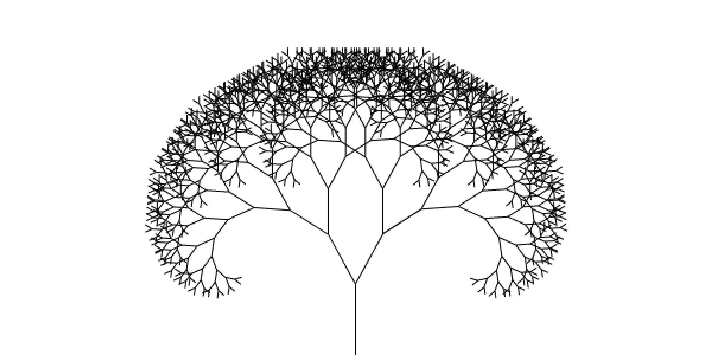

# Fractal Tree

In mathematics, a fractal is a subset of Euclidean space with a fractal dimension that strictly exceeds its topological dimension. Fractals appear the same at different scales, as illustrated in successive magnifications of the Mandelbrot set.

to read more : [here](https://en.wikipedia.org/wiki/Fractal)

