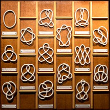

### Knot theory

In the mathematical field of topology, knot theory is the study of mathematical knots. While inspired by knots which appear in daily life, such as those in shoelaces and rope, a mathematical knot differs in that the ends are joined so it cannot be undone, the simplest knot being a ring (or "unknot").

to use another type see the website of [paulbourke](http://paulbourke.net/geometry/knots/)
