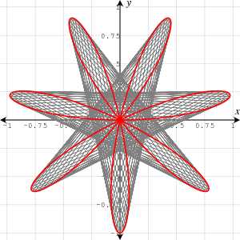
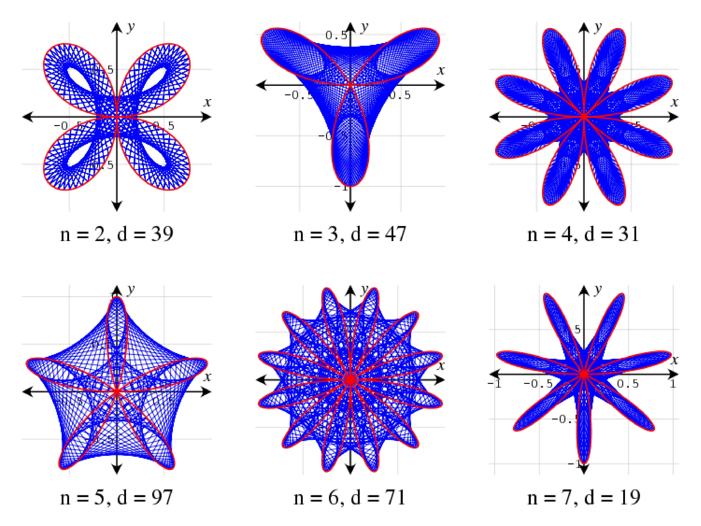

# Maurer Rose

In geometry, the concept of a Maurer rose was introduced by Peter M. Maurer in his article titled A Rose is a Rose. A Maurer rose consists of some lines that connect some points on a rose curve.

to read more : [here](https://en.wikipedia.org/wiki/Maurer_rose)

the angles of different rose shapes : 

