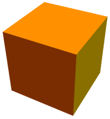

# Menger Sponge Fractal

In mathematics, the Menger sponge (also known as the Menger cube, Menger universal curve, Sierpinski cube, or Sierpinski sponge) is a fractal curve. It is a three-dimensional generalization of the one-dimensional Cantor set and two-dimensional Sierpinski carpet. It was first described by Karl Menger in 1926, in his studies of the concept of topological dimension.

to read more : [here](https://en.wikipedia.org/wiki/Menger_sponge)

