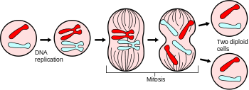

# Mitosis Simulation

In cell biology, mitosis is a part of the cell cycle in which replicated chromosomes are separated into two new nuclei. Cell division gives rise to genetically identical cells in which the total number of chromosomes is maintained.

to read more : [here](https://en.wikipedia.org/wiki/Mitosis)

in code i simulate the divide of cells on mouse click on the cell

