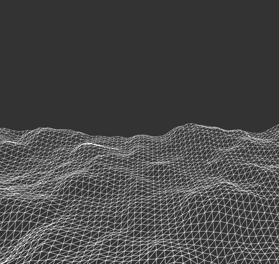

# Perlin Noise 3D

Ken Perlin developed perlin noise in 1983 as a result of his frustration with the "machine-like" look of computer-generated imagery (CGI) at the time.

to read more : [here](https://en.wikipedia.org/wiki/Perlin_noise)

|     processing code result |       p5.js code result         |
|    |         |
