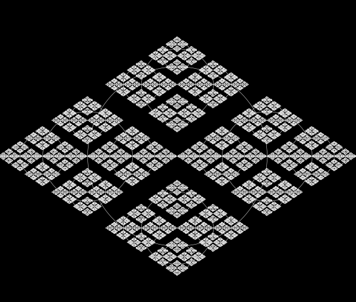

# Recursion

Recursion (adjective: recursive) occurs when a thing is defined in terms of itself or of its type. Recursion is used in a variety of disciplines ranging from linguistics to logic. The most common application of recursion is in mathematics and computer science, where a function being defined is applied within its own definition. While this apparently defines an infinite number of instances (function values), it is often done in such a way that no infinite loop or infinite chain of references ("crock recursion") can occur.

[read more](https://en.wikipedia.org/wiki/Recursion)

build beautiful shape using recursion : 

