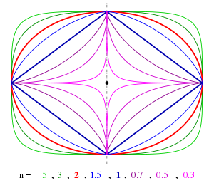

# Superellipse

A superellipse, also known as a Lamé curve after Gabriel Lamé, is a closed curve resembling the ellipse, retaining the geometric features of semi-major axis and semi-minor axis, and symmetry about them, but a different overall shape.

to read more : [here](https://en.wikipedia.org/wiki/Superellipse)

