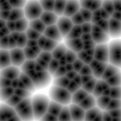

# Worley Noise

Worley noise is a noise function introduced by Steven Worley in 1996. In computer graphics it is used to create procedural textures. textures that are created automatically with arbitrary precision and do not have to be drawn by hand. Worley noise comes close to simulating textures of stone, water, or biological cells.
to learn more read this : [here](https://en.wikipedia.org/wiki/Worley_noise)

The algorithm chooses random points in space (2- or 3-dimensional) and then for every location in space takes the distances dn to the nth-closest point (e.g. the second-closest point) and uses combinations of those to control color information (note that dn+1 > dn). More precisely:

Randomly distribute feature points in space organised as grid cells. In practice this is done on the fly without storage (as a procedural noise). The original method considered a variable number of seed points per cell so as to mimic a Poisson distribution, but many implementations just put one.
At run time, extract the distances dn from the given location to the nth-closest seed point. This can be done efficiently by visiting the current cell and its neighbors.
Noise W(x) is formally the vector of distances, plus possibly the corresponding seed ids, user-combined so as to produce a color.
